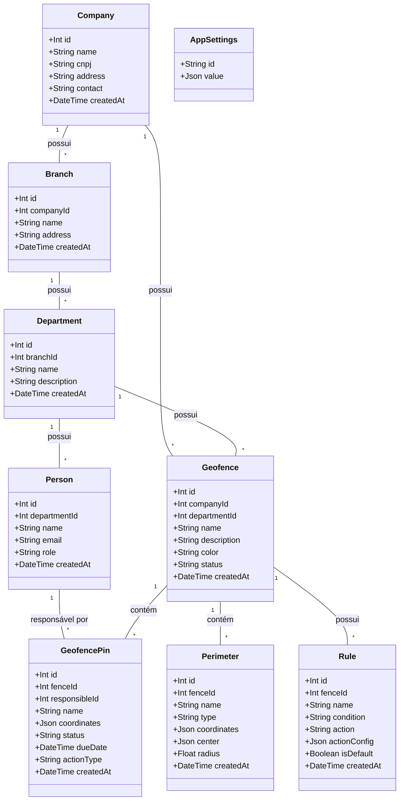

# Diagrama de Classes UML - iFence

```mermaid
classDiagram
    class Company {
        +Int id
        +String name
        +String cnpj
        +String address
        +String contact
        +DateTime createdAt
    }

    class Branch {
        +Int id
        +Int companyId
        +String name
        +String address
        +DateTime createdAt
    }

    class Department {
        +Int id
        +Int branchId
        +String name
        +String description
        +DateTime createdAt
    }

    class Person {
        +Int id
        +Int departmentId
        +String name
        +String email
        +String role
        +DateTime createdAt
    }

    class Geofence {
        +Int id
        +Int companyId
        +Int departmentId
        +String name
        +String description
        +String color
        +String status
        +DateTime createdAt
    }

    class Perimeter {
        +Int id
        +Int fenceId
        +String name
        +String type
        +Json coordinates
        +Json center
        +Float radius
        +DateTime createdAt
    }

    class Rule {
        +Int id
        +Int fenceId
        +String name
        +String condition
        +String action
        +Json actionConfig
        +Boolean isDefault
        +DateTime createdAt
    }

    class GeofencePin {
        +Int id
        +Int fenceId
        +Int responsibleId
        +String name
        +Json coordinates
        +String status
        +DateTime dueDate
        +String actionType
        +DateTime createdAt
    }

    class AppSettings {
        +String id
        +Json value
    }

    Company "1" -- "*" Branch : possui
    Company "1" -- "*" Geofence : possui
    Branch "1" -- "*" Department : possui
    Department "1" -- "*" Person : possui
    Department "1" -- "*" Geofence : possui
    Person "1" -- "*" GeofencePin : responsável por
    Geofence "1" -- "*" Perimeter : contém
    Geofence "1" -- "*" Rule : possui
    Geofence "1" -- "*" GeofencePin : contém
```
